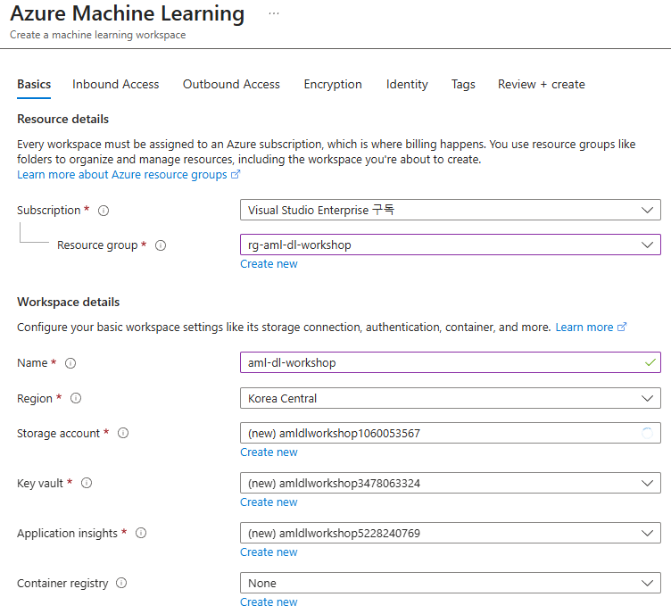
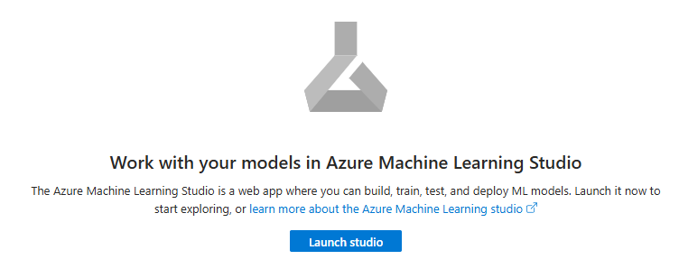
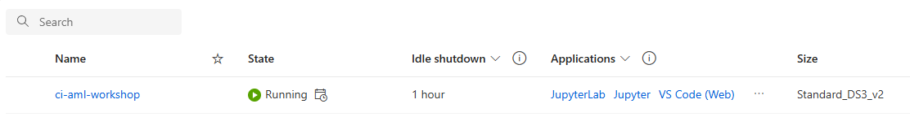

# Lab 00 — Azure Machine Learning 환경 준비 (Setup)

---

## Lab 목표

이 Lab에서는 Deep Learning 실습을 위한 Azure Machine Learning 기본 환경을 구성합니다.

완료 후 상태:

- Resource Group 생성
- Azure ML Workspace 생성
- AML Studio 접속
- Compute Instance 생성

이 단계는 이후 RAPIDS 전처리 및 PyTorch GPU 학습을 위한 준비 단계입니다.

---

## Workshop 전체 흐름에서의 위치

```
[현재] Setup
   ↓
RAPIDS 데이터 전처리
   ↓
PyTorch 모델 학습
   ↓
Triton Endpoint 배포
```

---

## Azure Machine Learning 란?

Azure ML Workspace는 ML 작업을 위한 관리 플랫폼입니다.

Workspace 생성 시 자동 생성 리소스:

- Storage Account
- Key Vault
- Container Registry
- Application Insights

---

# 1️⃣ Resource Group 생성

Azure Portal → Resource groups → Create

```
Resource group name : rg-aml-dl-workshop
Region              : Korea Central
```

---

# 2️⃣ Azure Machine Learning Workspace 생성

Azure Portal 검색:

```
Azure Machine Learning
```

설정:

```
Workspace name : aml-dl-workshop
Resource group : rg-aml-dl-workshop
Region         : Korea Central
```
생성 후 **Launch Studio** 클릭



---

# 3️⃣ Azure ML Studio 접속

Workspace 화면에서 Launch Studio 클릭 후 다음 메뉴 확인:



```
Authoring
Assets
Manage
```
---

# 4️⃣ Compute Instance 생성

좌측 메뉴:

```
Manage → Compute
```

생성:

```
Name    : ci-aml-workshop
VM Size : Standard_DS3_v2
```

상태가 Running 이 되면 완료입니다.

---

# 5️⃣ Compute Cluster 생성 (GPU)

좌측 메뉴:

```
Manage → Compute
```

**Compute clusters** 탭에서 새 클러스터 생성:

```
Compute name      : cc-aml-gpu
VM priority       : Low priority
VM type           : GPU
VM size           : Standard_NC6S_V3 (NCv3 series with Tesla V100)
Min nodes         : 0
Max nodes         : 1
Region            : Korea Central
```

> ⚠️ **주의**: NCv3 series (V100 GPU)가 필요합니다.  
> 만약 리전에서 사용 불가능하면 다른 리전으로 변경하세요.

생성 후 상태가 **Succeeded**로 변경되면 완료입니다.

---

## 💡 Quota 확인 (Important)

생성 전에 **Quota** 확인이 필수입니다:

**필요 Cores:**
- Compute Instance: 4 cores
- Compute Cluster: 6 cores
- **최대 동시 사용**: 10 cores

**확인 방법:**
```
Manage → Compute → 우측 상단 "Quota" 버튼
```

**Quota별 권장 구성:**

| 환경 | Quota | 가능여부 |
|------|-------|--------|
| 10 core | ✅ **정확히 맞음** | ✅ 가능 |
| 6 core 이상 | ⚠️ Instance만 가능 | ⚠️ Cluster 불가 |
| 6 core 미만 | ❌ 불충분 | ❌ 불가능 |

> 💡 **팁**: Compute Cluster는 **Job 실행 시에만** cores를 사용하고, **Job 종료 후 자동으로 0 nodes로 축소**되므로 Quota가 정확히 10 cores여도 안전합니다.

---

# 현재 구성

```
Azure ML Workspace
        ├── Compute Instance (CPU)
        │     └── 노트북 실행 환경 (ci-aml-workshop)
        │
        └── Compute Cluster (GPU)
              └── 스크립트 실행 환경 (cc-aml-gpu)
```

---

# ▶️ Next Lab

[01-preprocess-data-rapids.md](./01-preprocess-data-rapids.md)