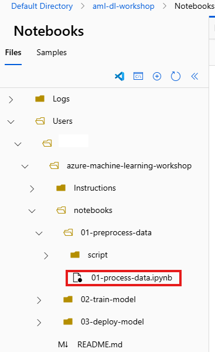
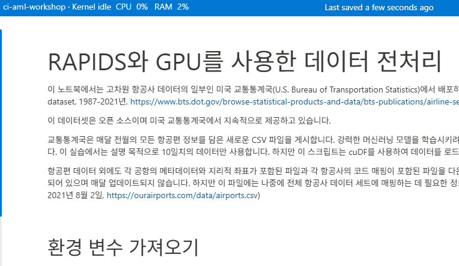
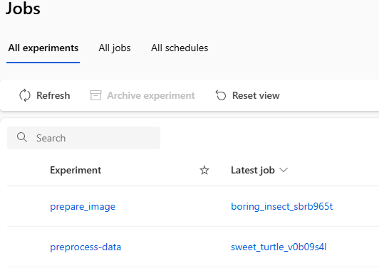

# Lab 01 — RAPIDS를 활용한 GPU 데이터 전처리

---

## Lab 목표

이 Lab에서는 RAPIDS를 활용하여 GPU 기반 데이터 전처리를 수행합니다.

완료 후 상태:

- Azure ML Notebook 환경 이해
- RAPIDS (cuDF) 기반 데이터 처리
- CPU vs GPU 데이터 처리 개념 이해

이 단계는 이후 PyTorch 모델 학습을 위한 데이터 준비 과정입니다.

---

## Workshop 전체 흐름에서의 위치

```
Setup
   ↓
[현재] RAPIDS 데이터 전처리
   ↓
PyTorch 모델 학습
   ↓
Triton Endpoint 배포
```

---

## RAPIDS란 무엇인가요?

RAPIDS는 NVIDIA에서 제공하는 GPU 데이터 사이언스 라이브러리입니다.

대표 구성:

- cuDF → GPU 기반 pandas
- cuML → GPU 기반 ML
- cuGraph → GPU 그래프 처리

---

## 사전 준비사항

아래를 먼저 완료하세요:
- [00-setup.md](./00-setup.md) 완료
  - ✅ Azure ML Workspace 생성
  - ✅ Compute Instance 생성
  - ✅ Compute Cluster 생성 (GPU)
  - ✅ Repository Clone

---

# Environment 생성 (RAPIDS)

RAPIDS 실행을 위해 **Custom Environment**를 생성해야 합니다.

**Step 1. Environments 페이지 이동**

Azure ML Studio 좌측:

```
Assets → Environments
```

---

**Step 2. Custom Environment 생성**

`+ Create`

설정:

```
Name        : rapids-mlflow
Description : RAPIDS cuDF environment with GPU support
Select environment source : Create a new docker context
```

---

**Step 3. Select environment type 선택**

`Dockerfile` 선택 후, 아래 Dockerfile 코드 입력:

```dockerfile
FROM rapidsai/rapidsai:21.10-cuda11.0-runtime-ubuntu18.04-py3.7
SHELL ["/bin/bash", "-c"]
RUN apt-key adv --fetch-keys https://developer.download.nvidia.com/compute/cuda/repos/ubuntu1804/x86_64/3bf863cc.pub \
   && apt-get update \
   && apt-get install -y fuse \
   && conda run -n rapids pip install azureml-mlflow azureml-dataprep \
   && apt-get clean \
   && rm -rf /var/lib/apt/lists/*
ENV PATH=/opt/conda/envs/rapids/bin:$PATH
ENV CONDA_DEFAULT_ENV=rapids
```

---

**Step 4. 생성 및 빌드**

`Create` 클릭 → Azure ML이 자동으로 Docker 이미지 빌드

> ⏳ 이미지 빌드는 5~10분 소요
> 
> 빌드 진행률은 Environment의 **Details** 탭에서 확인 가능

빌드 완료 후 상태: **Running**

---

# 1️⃣ Notebook Repository 준비

## Step 1. Azure ML Studio 이동

왼쪽 메뉴:

```
Authoring → Notebooks
```

---

## Step 2. Terminal 열기

상단 메뉴에서 Terminal 실행 후 아래 명령어 입력:

```
git clone https://github.com/wonsungso/azure-machine-learning-workshop
```

Notebooks 목록에 아래 폴더가 생성되면 정상입니다.
```
(azureml_py38) azureuser@ci-aml-workshop:~/cloudfiles/code/Users/user$ ls
azure-machine-learning-workshop
```
---

# 2️⃣ RAPIDS Notebook 실행

아래 경로의 Notebook을 엽니다.

```
azure-machine-learning-workshop/Notebooks/01-preprocess-data/01-process-data.ipynb
```


Kernel 선택:

```
Python 3.10 (RAPIDS 환경)
```

---

## 💡 Workshop Tip

Kernel이 보이지 않는 경우:

- Compute Instance가 Running 상태인지 확인
- Kernel 재연결 (Reconnect)

---

# 3️⃣ 노트북 실행 — Azure ML에 작업 제출



노트북(`01-process-data.ipynb`)의 코드가 기준입니다.

아래는 실행 순서만 간단히 안내합니다.

1. 위에서부터 셀 순서대로 실행
2. 제출 셀 실행 후 완료까지 대기 (`run.wait_for_completion(show_output=True)`)

> ⏳ Image 준비 및 GPU Cluster Resize Job 은 10~15 분 소요 됩니다.
> ⏳ Data Processing Job은 4~5 분 소요 됩니다.
> 상세 코드는 이 문서가 아니라 노트북 셀 내용을 그대로 따르세요.

---

## 왜 GPU 전처리를 사용할까요?

Deep Learning에서는 데이터 크기가 매우 큽니다.

GPU를 활용하면:

- 데이터 로딩 속도 향상
- Feature Engineering 가속
- 학습 전처리 시간 단축

---

# 4️⃣ 작업 실행 모니터링 및 결과 확인

노트북 실행 후 Azure ML Studio에서 결과를 확인합니다.

1. **Jobs** → **All experiments**
2. `preprocess-data` 선택
3. 최신 Job 클릭
4. 아래 2가지 확인
   - **Overview**: 상태/실행 시간
   - **Outputs+logs**: 로그 및 출력 파일



---

## 다음 단계

생성된 `outputs/processed_data.csv` 파일은 다음 Lab의 PyTorch 모델 학습에 사용됩니다.

---

# 현재까지 구성된 아키텍처

```
Azure ML Workspace
        └── Compute Instance
                └── RAPIDS Notebook 실행
```

다음 Lab에서는 GPU Compute Cluster가 추가됩니다.

---

---

# ⏹️ 실습 종료 후 리소스 중지

비용 절감을 위해 Compute Instance를 중지하세요.

**Step 1. Compute 페이지 이동**

Azure ML Studio 좌측:

```
Manage → Compute → Compute Instances
```

**Step 2. Compute Instance 선택**

```
ci-aml-workshop
```

**Step 3. Stop 클릭**

상태가 **Stopped**으로 변경되면 비용 청구 중단됩니다.

> 💡 **참고**: Compute Cluster는 사용 후 자동으로 종료되므로 수동 중지 불필요합니다.

---

# ▶️ Next Lab

[02-train-model-pytorch](./02-train-model-pytorch.md)

GPU Compute Cluster를 사용하여 PyTorch 모델 학습을 진행합니다.