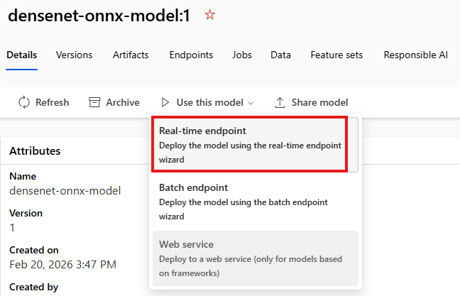
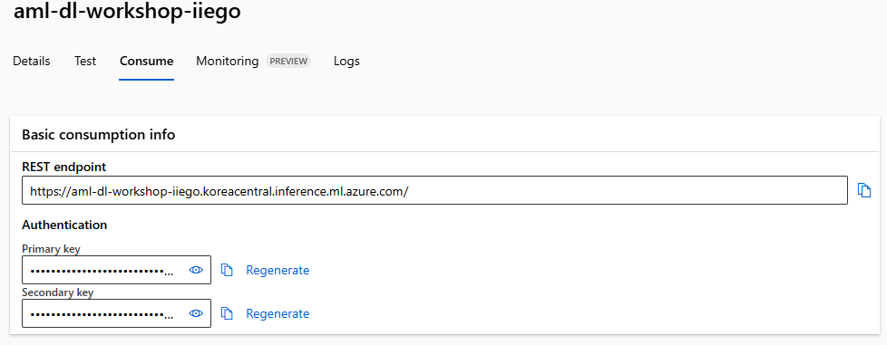

# Lab 03 — Triton ONNX 모델을 Managed Online Endpoint에 배포

---

## Lab 목표

이 Lab에서는 Triton no-code deployment를 사용해 ONNX 모델을 Azure Machine Learning Managed Online Endpoint로 배포합니다.

완료 후 상태:

- Triton 형식 모델 등록
- Managed Online Endpoint + Deployment 생성
- Endpoint 호출(추론) 확인

---

## 사전 준비사항 (Before you start)

아래를 먼저 완료하세요:
- [00-setup.md](./00-setup.md) 완료
- [01-preprocess-data-rapids.md](./01-preprocess-data-rapids.md) 완료
- [02-train-model-pytorch.md](./02-train-model-pytorch.md) 완료

> 이 Lab은 **GPU Compute Cluster가 필요하지 않습니다.**
> Endpoint 배포는 Managed Online Endpoint에서 수행합니다.

---

## Workshop 전체 흐름에서의 위치

```
Setup
   ↓
RAPIDS 데이터 전처리
   ↓
PyTorch 모델 학습
   ↓
[현재] Triton Endpoint 배포 및 호출
```

---

# 1️⃣ 모델 등록 (CLI)

## Step 1. Compute Instance 확인 및 Terminal 열기

Azure ML Studio에서:

```
Manage → Compute → Compute Instances
```

`ci-aml-workshop`이 Running인지 확인한 뒤, Notebooks 화면에서 Terminal을 엽니다.

---

## Step 2. 배포 폴더로 이동

Terminal에서 아래 명령 실행:

```bash
cd ~/cloudfiles/code/Users/<your-user-name>/azure-machine-learning-workshop/Notebooks/03-deploy-model
```

---

## Step 3. Azure ML CLI 확장 정리/설치 및 로그인

```bash
az extension remove -n azure-cli-ml
az extension remove -n ml
az extension add -n ml -y
az login
```

---

## Step 4. Triton 모델 등록

폴더 내 `create-triton-model.yaml`을 사용해 모델 등록:

```bash
az ml model create -f create-triton-model.yaml
```

완료 후 **Assets → Models**에서 `densenet-onnx-model`이 생성되었는지 확인합니다.


---

# 2️⃣ Managed Online Endpoint 배포

## Step 1. 모델에서 배포 시작

Azure ML Studio에서:

```
Assets → Models → densenet-onnx-model
```

`Use this model` → `Real-time endpoint` 선택


---

## Step 2. 배포 설정

- Instance count: `1`
- Virtual machine:
  - 선호 순서: `Standard_NC6s_v3` (GPU) 혹은 `Standard_D2as_v4` (CPU)
  - Quota 제약이 있으면 CPU 인스턴스를 선택합니다.
- Endpoint: **New**
- Endpoint name: `aml-dl-workspace-<랜덤스트링>` (예: `aml-dl-workshop-jvaki`)
- Deployment name: `densenet-onnx-model-1` (자동 생성)

배포 완료까지 일반적으로 약 15~20 분 소요됩니다.

---

## Step 3. Endpoint 정보 저장

배포 완료 후 Endpoint의 **Consume** 탭에서 아래 값을 복사해 저장하세요.

- REST endpoint
- Primary key



이 값은 다음 단계(호출 노트북)에서 사용합니다.

---

## ⚠️ 배포 실패 시 트러블슈팅

### 에러 1: "Resource provider [N/A] isn't registered"

**원인**: 구독의 필요한 리소스 공급자가 등록되지 않음

**해결책**:

Azure Portal에서 아래 리소스 공급자를 **등록 순서대로** 확인/등록하세요:

**우선 순위 (필수)**
- `Microsoft.MachineLearningServices`
- `Microsoft.CDN`
- `Microsoft.PolicyInsights`

**추가 (필요한 경우)**
- `Microsoft.Storage`
- `Microsoft.ContainerRegistry`
- `Microsoft.KeyVault`
- `Microsoft.Notebooks`
- `Microsoft.Network` (Virtual Network 사용 시)

**등록 방법**:
1. Azure Portal → 구독 선택
2. **리소스 공급자(Resource providers)** 검색
3. 각 공급자의 상태 확인
4. NotRegistered인 경우 **Register** 클릭
5. Endpoint 배포 재시도

---

# 3️⃣ Endpoint 호출 테스트

아래 노트북을 엽니다:

```
azure-machine-learning-workshop/Notebooks/03-deploy-model/03-invoke-endpoint.ipynb
```

노트북 지시에 따라 endpoint URL/key를 입력하고 셀을 실행해 추론 결과를 확인합니다.

호출 노트북 체크포인트:

- 라이브러리 설치 셀 실행 완료
- `endpoint_url`, `primary_key`를 실제 값으로 입력
- 실행 로그에 예측 Top-K 결과 출력 확인

---

# 4️⃣ 실습 종료 후 정리

## Step 1. Compute Instance 중지

```
Manage → Compute → Compute Instances → ci-aml-workshop → Stop
```

## Step 2. Endpoint 삭제

```
Assets → Endpoints → 생성한 endpoint → Delete
```

## Step 3. 전체 리소스 정리

Workshop을 완전히 종료할 경우:

```
Azure Portal → Resource Groups → rg-aml-dl-workshop → Delete resource group
```

---

# 🎉 Workshop 완료

축하합니다! 이번 워크샵에서 다음을 모두 경험했습니다.

- Azure ML Workspace/Compute 구성
- RAPIDS 기반 GPU 전처리
- PyTorch GPU 학습
- Triton 기반 실시간 엔드포인트 배포/호출
